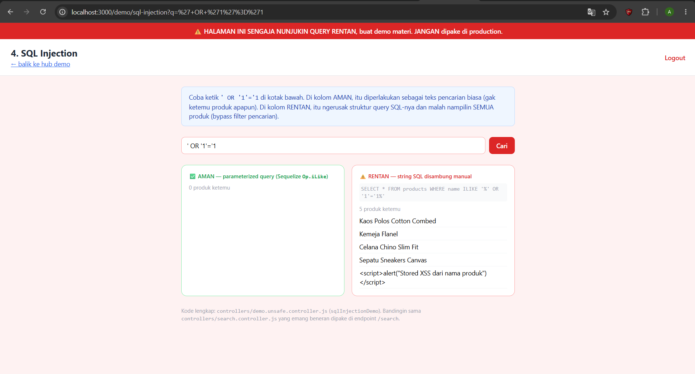
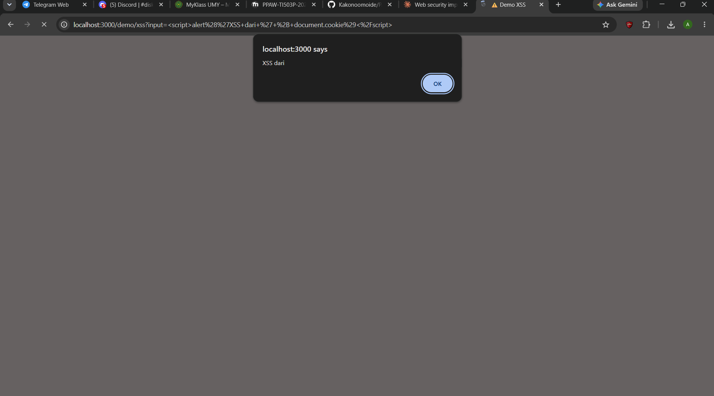
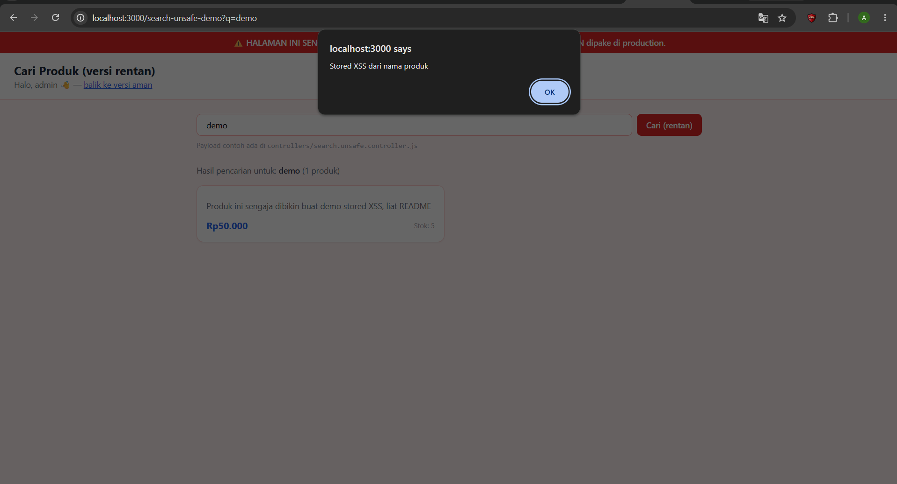
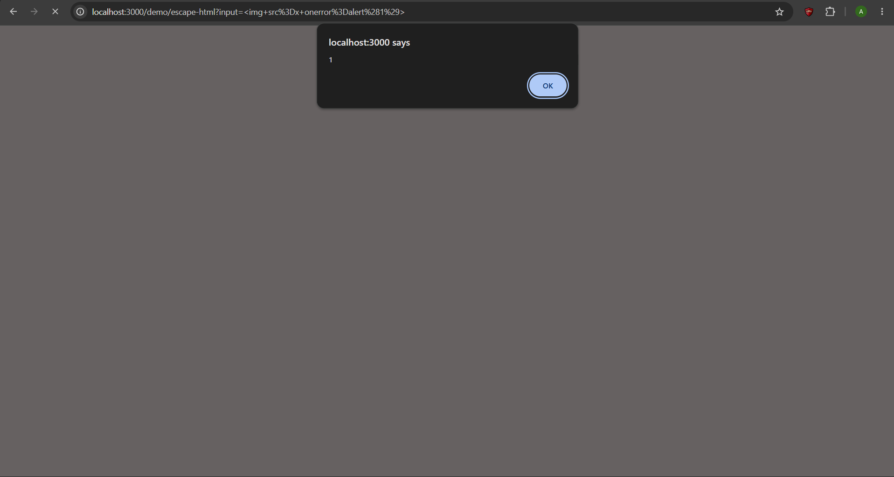
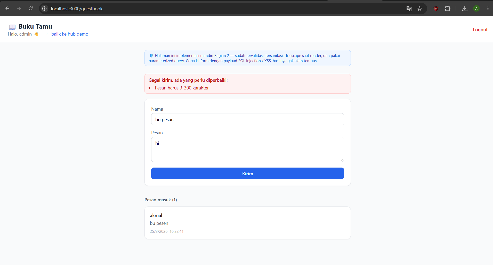
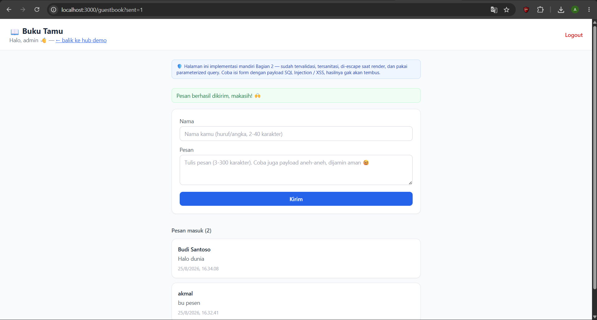
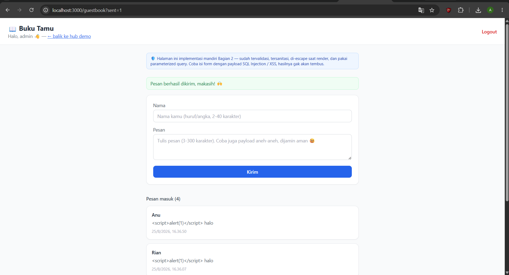
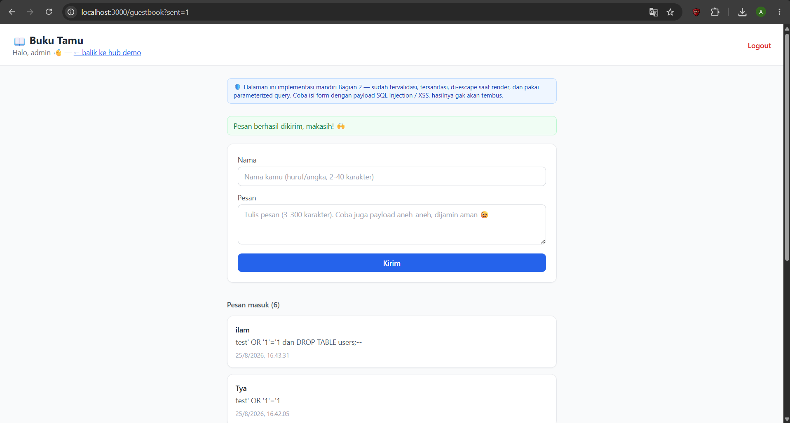

# Tugas 12 — Web Security (Validasi, Sanitasi, Escape HTML, SQL Injection, XSS)

**Nama:** [ISI NAMA]
**NIM:** [ISI NIM]
**Kelas:** [ISI KELAS]
**Repo:** `PAW-ANTARA-WEEK12-[NIM]`

> Semua kode, penjelasan teknis, dan screenshot di bawah sudah diuji langsung
> di server yang jalan lokal (login sebagai `admin`), dan seluruh screenshot
> sudah diambil dari hasil pengujian nyata.

---

## Bagian 1 — Eksplorasi `secure-search-app` (bawaan)

Langkah: fork repo asli → set `ENABLE_VULN_DEMO=true` di `.env` → `npm install && npm run seed && npm run dev` → login (`admin` / `password123`) → coba tiap halaman `/demo/*`.

### 1. SQL Injection — `/demo/sql-injection`

**Payload:** `' OR '1'='1`



Kolom AMAN (parameterized query) menghasilkan **0 produk ketemu**, sedangkan kolom RENTAN (string SQL disambung manual) menghasilkan **5 produk ketemu** — SEMUA produk tampil, termasuk yang berisi payload XSS dari seeder.

**Kenapa tembus:** kolom rentan dibentuk di `controllers/demo.unsafe.controller.js` (fungsi `sqlInjectionDemo`) dengan menyambung string SQL langsung pakai template literal: `` `SELECT * FROM products WHERE name ILIKE '%${q}%'` ``. Karena `q` disisipkan mentah-mentah ke dalam teks query, payload `' OR '1'='1` membuat query jadi `...WHERE name ILIKE '%%' OR '1'='1%'` — kondisi `'1'='1'` selalu benar, jadi filter pencarian ke-bypass dan semua produk ikut tampil. Kolom aman di sebelahnya (`Product.findAll` dengan `Op.iLike`) tidak kena karena Sequelize mengirim `q` sebagai parameter terpisah, bukan bagian dari teks SQL.

### 2. XSS Reflected — `/demo/xss`

**Payload:** `<script>alert('XSS dari ' + document.cookie)</script>`



Alert box beneran muncul dari browser (`localhost:3000 says`) menampilkan teks "XSS dari" — bukti script asing berhasil dieksekusi oleh browser.

**Kenapa tembus:** `xssDemo` di `controllers/demo.unsafe.controller.js` cuma mengambil `req.query.input` tanpa validasi/sanitasi apa pun, lalu `views/demo/xss.ejs` menampilkannya kembali (lihat pola yang sama seperti di `search-unsafe.ejs`) memakai tag EJS raw `<%- %>`, bukan `<%= %>`. Karena `<%- %>` tidak meng-escape karakter HTML, tag `<script>` yang dikirim lewat URL benar-benar dirender sebagai elemen `<script>` sungguhan oleh browser dan langsung dieksekusi — termasuk bisa membaca `document.cookie` milik sesi yang sedang login.

### 3. XSS Stored — `/search-unsafe-demo`

**Payload:** tidak perlu diketik manual — cukup search kata yang match ke produk seeder (mis. `demo`, karena ada di deskripsi produknya) di `/search-unsafe-demo`.



Alert box otomatis muncul menampilkan **"Stored XSS dari nama produk"** — tanpa perlu mengetik payload apa pun, cukup buka halaman yang menampilkan produk tersebut. Kartu produknya sendiri terlihat "kosong" di bagian nama karena `<script>...</script>` dieksekusi jadi elemen script (tidak punya tampilan visual), bukan ditampilkan sebagai teks.

**Kenapa tembus:** `seeders/seed.js` sengaja mengisi salah satu `Product.name` dengan literal `<script>alert("Stored XSS dari nama produk")</script>` di database. `views/search-unsafe.ejs` menampilkan `product.name` pakai `<%- product.name %>` (raw, bukan escape). Bedanya dengan reflected: payload ini sudah "nempel" permanen di database, jadi otomatis tereksekusi ke **setiap** orang yang membuka halaman itu, tanpa perlu mengetik apa pun — beda dengan reflected XSS yang cuma kena ke orang yang mengklik link berisi payload.

### 4. Escape HTML — `/demo/escape-html`

**Payload:** ``



Alert box beneran muncul menampilkan **"1"** — hasil `alert(1)` dari atribut `onerror` pada tag `` yang gagal load gambar, berhasil dieksekusi di kotak `<%- %>` (raw/unescaped).

**Kenapa tembus (kotak kedua):** `views/demo/escape-html.ejs` sengaja membandingkan dua cara EJS mencetak variabel yang sama persis: `<%= input %>` (auto-escape) vs `<%- input %>` (raw/unescaped). Karena `` dengan atribut `onerror` yang gagal load gambar (`src=x`) otomatis memicu event `onerror`, versi raw benar-benar merender elemen `` sungguhan dan menjalankan `alert(1)`. Versi `<%= %>` mengubah `<` dan `>` jadi entity (`&lt;`, `&gt;`) sehingga browser cuma menampilkannya sebagai teks, bukan elemen HTML.

---

## Bagian 2 — Implementasi Mandiri: **Buku Tamu (Guestbook)**

Halaman baru di `/guestbook` (menu tambahan "📖 Buku Tamu" di hub `/demo`) — form nama + pesan yang tampil ke semua pengunjung, dibuat aman dari kelima celah di atas.

File yang ditambahkan/diubah:
- `models/comment.model.js` — model `Comment` (name, message)
- `middlewares/validators.js` — `guestbookValidationRules`
- `controllers/guestbook.controller.js` — `showGuestbook`, `postComment`
- `routes/guestbook.routes.js`
- `views/guestbook.ejs`
- `app.js`, `views/demo/index.ejs` (registrasi route & link menu)

### 1️⃣ Validasi server-side

`middlewares/validators.js`:

```js
const guestbookValidationRules = [
  body('name')
    .trim()
    .customSanitizer((value) => value.replace(/\s+/g, ' '))
    .isLength({ min: 2, max: 40 })
    .withMessage('Nama harus 2-40 karakter')
    .matches(/^[a-zA-Z0-9 .'-]+$/)
    .withMessage('Nama cuma boleh huruf, angka, spasi, titik, apostrof, dan strip'),

  body('message')
    .trim()
    .customSanitizer((value) => value.replace(/\s+/g, ' '))
    .isLength({ min: 3, max: 300 })
    .withMessage('Pesan harus 3-300 karakter'),
];
```

Rules ini dipasang di route (`routes/guestbook.routes.js`) sebelum controller, jadi jalan di server terlepas dari validasi HTML/JS di browser.

**Uji:** submit pesan terlalu pendek (`message=hi`, cuma 2 karakter) lewat form `/guestbook`. Server tetap menolak dan mengembalikan pesan spesifik, walau data yang gagal tetap ditampilkan lagi di form:



### 2️⃣ Sanitasi

Sanitasi (`.trim()` + `customSanitizer` merapikan spasi ganda) dijalankan di rules yang sama di atas, **sebelum** data disimpan ke database.

**Before / after**:

| Field | Sebelum (raw input) | Sesudah (tersimpan & tampil di halaman) |
|---|---|---|
| `name` | `"  Budi   Santoso  "` | `"Budi Santoso"` |
| `message` | `"  Halo   dunia  , ini pesan test sanitasi  "` | `"Halo dunia , ini pesan test sanitasi"` |



> Catatan desain: sanitasi di sini sengaja **cuma** trim + rapikan spasi (bukan
> `.escape()`), supaya data mentah di database tetap utuh dan escape karakter
> HTML dikerjakan satu kali saja — di titik render (poin #3), sesuai praktik
> OWASP "encode on output". Ini menghindari double-encoding kalau data yang
> sudah di-escape saat disimpan, di-escape lagi saat ditampilkan.

### 3️⃣ Escape HTML saat render

`views/guestbook.ejs` menampilkan `comment.name` dan `comment.message` pakai `<%= %>` (auto-escape), bukan `<%- %>`:

```ejs
<p class="font-semibold text-gray-800 text-sm mb-1"><%= comment.name %></p>
<p class="text-sm text-gray-600 whitespace-pre-wrap"><%= comment.message %></p>
```

**Uji payload:** `message = <script>alert(1)</script> halo`, dikirim dua kali (nama "Anu" dan "Rian").



Teksnya tampil apa adanya sebagai tulisan biasa `<script>alert(1)</script> halo` di kartu pesan — **tidak ada alert/popup yang muncul sama sekali**. Karena tag `<script>` sudah di-escape jadi entity (`&lt;script&gt;`) oleh `<%= %>`, browser cuma menampilkannya sebagai teks, bukan elemen script yang dieksekusi.

### 4️⃣ Parameterized query / ORM

`controllers/guestbook.controller.js`:

```js
// Comment.create() lewat Sequelize ORM ngirim `name` & `message` sebagai
// bind parameter terpisah dari perintah SQL-nya, BUKAN disambung jadi
// satu string kayak di search.unsafe.controller.js.
await Comment.create({ name, message });
```

```js
const comments = await Comment.findAll({ order: [['createdAt', 'DESC']] });
```

Tidak ada satu pun `sequelize.query()` dengan string SQL yang disambung manual di fitur ini — semua akses database lewat method Sequelize ORM (`create`, `findAll`), yang otomatis memakai prepared statement di level driver `pg`.

### 5️⃣ Uji serang ke halaman sendiri

**Payload SQL Injection** (sama seperti Bagian 1): `test' OR '1'='1 dan DROP TABLE users;--`

Dikirim sebagai `message` lewat form biasa. Hasilnya cuma tersimpan sebagai teks literal, bukan dieksekusi sebagai perintah SQL — halaman tetap jalan normal, tidak ada error, dan tabel `users` tetap utuh (tidak ke-drop):



**Kesimpulan pengujian:** payload SQL Injection dan XSS yang berhasil menembus demo bawaan di Bagian 1 **semuanya gagal** ketika dicoba di halaman `/guestbook` buatan sendiri, karena ditangani oleh 4 lapis kontrol di atas (validasi, sanitasi, escape saat render, parameterized query).


